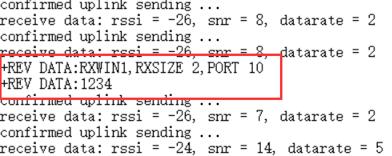

# 发布MQTT消息
[English](https://heltec-automation-docs.readthedocs.io/en/latest/general/publish_mqtt_message.html)

在操作以前，应确保已经连接网关和节点，并且网关和节点能正常工作。

&nbsp;

## MQTT接入Cloud Server

- 打开MQTT.fx，点击设置按钮配置连接信息。


- 如下图所示配置相关信息。其中"Broker Address"为网关连接的服务器地址，"Broker Port"默认选择1883，"Client ID"可点击"Generate"随机生成。并配置登录账号和密码。


- 配置完成后点击"Connect"连接。


- 连接成功后可看到右边显示绿色亮点。


&nbsp;

## 发布MQTT消息

- 配置主题信息。

  

  - 其中"application/4/device/2232330000888809/tx"分别对应"application/[应用ID]/device/[DevEUI]/[事件类型]"。

  

  

  - 发布的数据如下：

    ```shell
    {
        "fPort": 10,    //使用端口(fPort > 0)
        "data": "EjQ="  //发送数据
    }
    ```

  - 其中发布的数据需使用Base64编码。如下图所示。


- 发布的数据编辑完成后，点击"Publish"，你就能在节点的串口打印中看到发布的数据。

