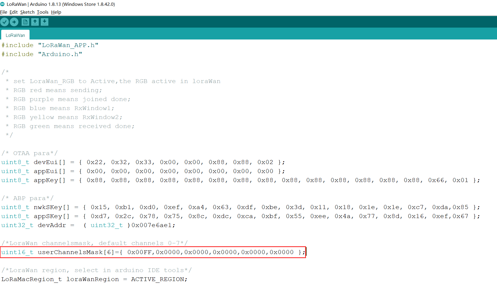

#  	LoRaWAN子频带使用示例（AU915）
[English](https://heltec-automation-docs.readthedocs.io/en/latest/general/sub_band_usage.html)
## 说明

在LoRaWAN 协议中，各国或地区都有详细的规定。这些规定包括上行和下行信道频率、带宽、占空比等。

**[LoRaWAN 1.0.2 rvB 区域参数定义](https://resource.heltec.cn/download/LoRaWANRegionalParametersv1.0.2_final_1944_1.pdf)**

以AU915为例：

让我们看看代码: (在LoRaWAN对应的`.ino`文件中)

CubeCell系列可参考"LoRaWAN",ESP32系列可参考"OTTA"。

	

这是为AU915定义的所有LoRaWAN 协议通道的6个阵列。在userChannelsMask[0]中，0x00FF表示使用前0-7个信道，它们是915.2MHz、915.4MHz、915.6MHz…916.6MHz。当您将该值设置为0xFF00时，意味着通道更改为8-15，它们是916.8MHz、917.0MHz…918.2MHz。更多细节......见下图：

TTN仅对AU915使用第二子带（信道8至15和65）：

[https://www.thethingsnetwork.org/docs/lorawan/frequency-plans.html](https://www.thethingsnetwork.org/docs/lorawan/frequency-plans.html)

## 使用方法

一般来说，要更改通道为8-15，我们只需要更改"channelsMaskTemp[0]=0xFF00"，然后上行链路频率将更改为支持TTN。

**你的LoRa 网关的监听频率必须与TTN服务器相同。它在网关的“gloable_conf.json”文件中定义。**