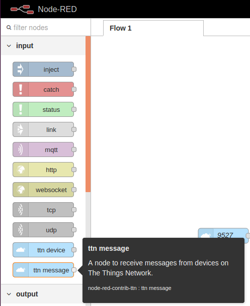
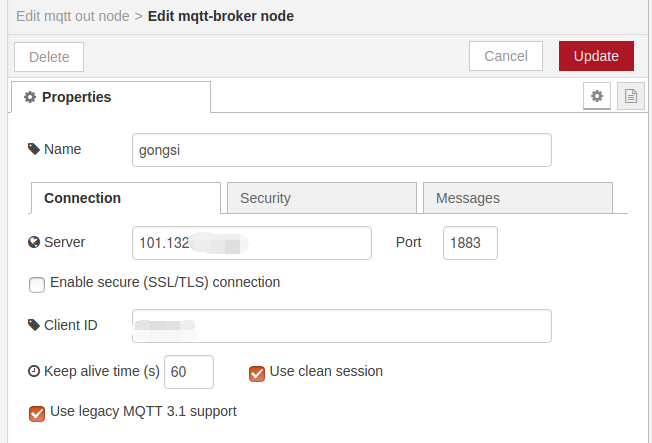
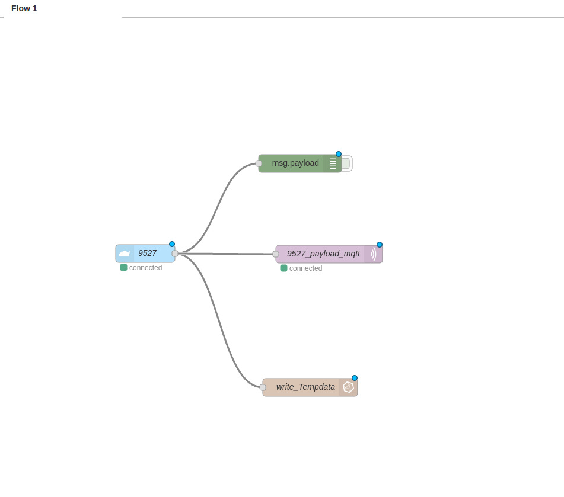
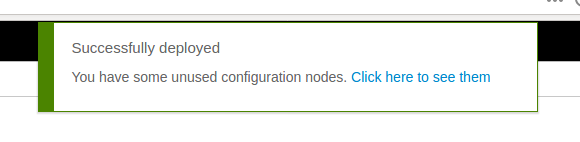
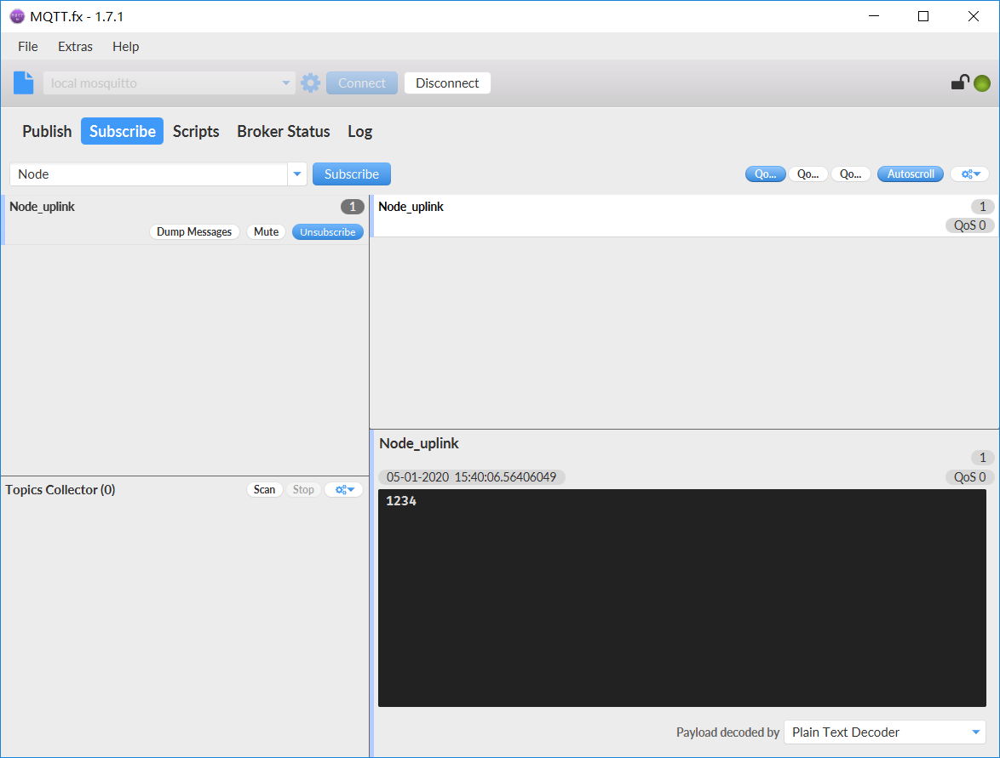
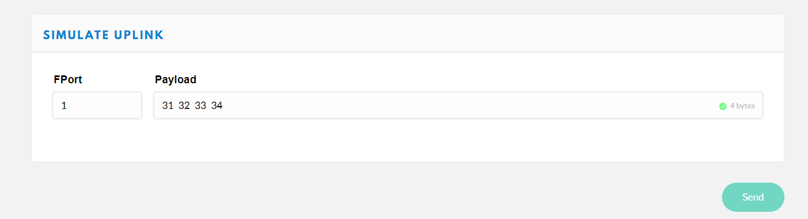

# 如何从LoRa服务器订阅MQTT消息

## 概述

本文的目的是使用TTN提供的数据流应用Node-Red中的MQTT插件订阅来自TTN节点的数据消息。

这个实验中使用的是 [HT-M02](https://heltec.org/project/ht-m02/)网关和 [CubeCell-board](https://heltec.org/project/htcc-ab01/)节点.

也许您没有真正的设备。您仍然可以通过TTN提供的模拟上行链路来测试这个解决方案。如何使用请看下面。

----------
## 准备

- 首先我们需要将LoRa网关和节点连接到TTN（ESP32系列和Cubecell系列都可用）

  如何将网关和节点连接到TTN请参阅：

  - **[怎样连接HT-M01到TTN (The-Things-Network)](https://heltec-automation.readthedocs.io/zh_CN/latest/gateway/ht-m01/connect_to_server.html)**
  
  - **[怎样通过LoRaWAN协议(TTN)把CubeCell连接到LoRa网关](https://heltec-automation.readthedocs.io/zh_CN/latest/cubecell/lorawan/connect_to_gateway.html)**
  
- 本文中安装的Node-Red和MQTT-Broker软件的Linux版本是Ubuntu 16.04。（这里使用的MQTT代理是Mosquitto）。

- MQTT.fx软件用于测试它是否可以订阅节点消息

  - 关于MQTT.fx : http://mqttfx.jensd.de 

### 下载并安装Node-red（需要等待很长时间）

如果您使用的是Raspberry-Pi或任何基于Debian的操作系统，包括Ubuntu和Diet-Pi，那么您可以使用这里提供的Pi安装脚本。

```Shell
bash <(curl -sL https://raw.githubusercontent.com/node-red/raspbian-deb-package/master/resources/update-nodejs-and-nodered)
```

如果要安装到其他操作系统，如Windows、RedHat、CentOS，请参阅Node-Red的官方安装指南：

  - **[https://nodered.org/docs/getting-started/local](https://nodered.org/docs/getting-started/local)**

------------------
## 配置Node-Red

我访问ubuntu中Node-Red提供的web界面，因此通过浏览器访问的端口是：`localhost:1880`

然后我们需要下载Node-Red的TTN插件。

### 将TTN选项板添加到Node-red

  - **通过Node-Red面板中的用户设置安装**

    

  - **从命令行安装**
```Shell
    npm install node-red-contrib-ttn@2.0.1
```
我们需要从TTN配置数据源，如APP EUI、APP KEY、DevEUI等参数“……
我们从面板左侧的ttn插件中选择 INPUT-> ttn_message面板，将其拖到右侧的Flow面板中。



接下来，双击它，填充关键参数，如我们在TTN中注册的application EUI、key和Device ID。


配置后单击`Update`。

### 配置MQTT插件

我们需要配置MQTT插件转发的主题。

例如，现在我想通过MQTT插件将一个节点的上行消息包装成一个名为“node_uplink”的主题，并将其转发给我的私有MQTT代理。

首先，选择左面板中的OUTPUT->mqtt选项板。将其拖到右侧的面板中。


接下来，双击它来填写我们的转载主题。





在填满所有的选项板之后，我们必须将它们连接起来。



请不要忘记在完成所有配置后，单击右上角的“Deploy”按钮以使其生效。



------------------
## 查看订阅

使用MQTT.fx软件订阅此主题。如果进展顺利，我们将在MQTT.fx软件中看到CubeCell开发板的默认上行数据“1、2、3、4.”（ASCII:31 32 33 34）。



我们通过MQTT成功地订阅了TTN中节点的上行链路数据的有效负载。
如果您没有真正的设备，可以使用TTN为您准备的SIMULATE UPLINK，可以如下使用：



它在您创建的Application-> Device页面中。

单击发送以模拟节点的上行链路数据。

---------------------