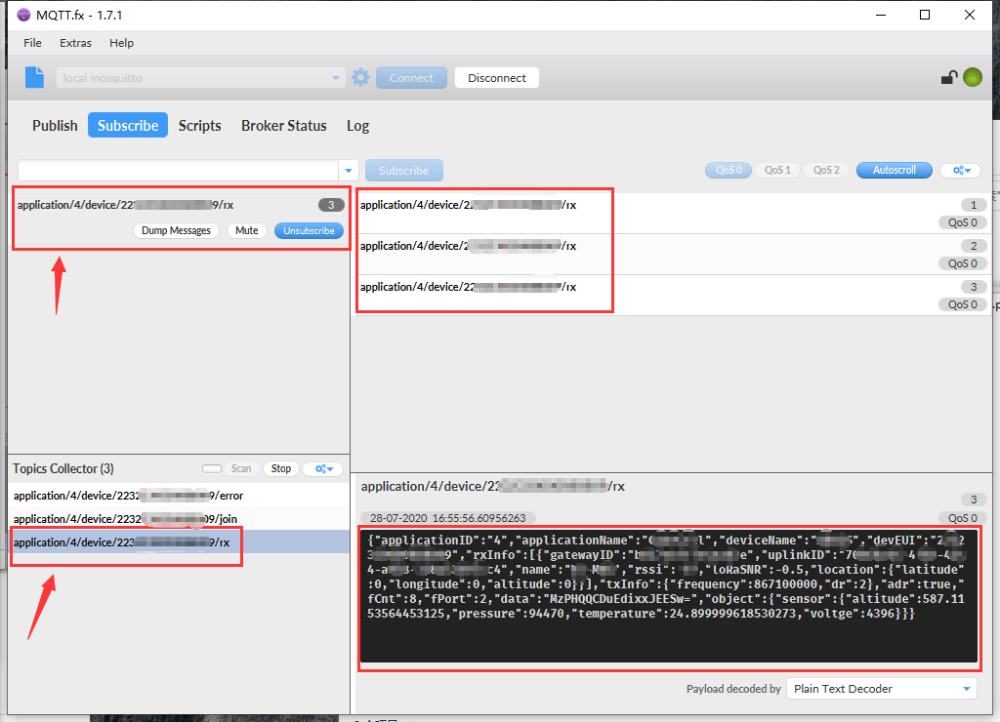

# 如何从LoRa服务器订阅MQTT消息
[English](https://heltec-automation-docs.readthedocs.io/en/latest/general/subscribe_mqtt_messages.html)

## 概述

在LoRaWAN应用框架中，[MQTT](https://mqtt.org)被广泛使用。 例如，您的LoRa节点设备将传感器数据发送到网关，并且网关将这些数据转发到云服务器，我们如何从云服务器获取这些传感器数据？

本文的目的是提供一些如何从云服务器获取MQTT消息的示例。 希望这些示例可以为您的应用程序提供参考或有意义。

```Tip:: MQTT成功订阅的四个关键：1.主机地址，2.主机端口，3.用户名/密码，4. MQTT主题。

```

- [通过Python](#python)
- [通过第三方应用(MQTT.fx)](#mqtt-fx)

----------

## 通过Python

这是一个简单的python3示例，可用于从服务器订阅MQTT消息。

[mqtt-receiver.py](https://resource.heltec.cn/download/tools/mqtt-reciver.py)

在简单的python示例中，需要根据您的实际情况修改三个红色框中的内容：


- `username_pw_set` -- MQTT订阅的用户名和密码。
  - 对于HT-M02 PoE Edge LoRa网关，默认用户名为“ loraroot”，密码为“ 62374838”。
  - 对于[Heltec LoRa Cloud Server](http://cloud.heltec.org)，登录信息就是MQTT订阅的用户名和密码。
- `subscribe ` -- MQTT主题名称，在示例代码中，“ 2”是服务器分配的应用程序ID。
- `HOST` and `PORT` -- MQTT服务器地址和通信端口。

使用Python3中运行它，红线标注的内容是节点发送的数据。 它以BASE64格式加密

`python3 mqtt-receiver.py` 	


如果该示例无法正确运行，则可能缺少相关组件，请通过以下命令进行安装。

`sudo pip3 install paho-mqtt python-etcd`

## 通过第三方应用(MQTT.fx)

网上有许多有用的MQTT订阅和推送软件。 本文以[MQTT.fx](https://mqttfx.jensd.de/index.php)为例。


- 使用以上设置可以进行基本通信。 然后点击`Connect`。

- 依次点击 `Subscribe` -> `Scan` ,等待接入的节点传输数据。


---------------------

- 当有节点上传数据后，将会在 `Scan`栏扫描到信息。


- 选中一个作为订阅信息，当有匹配的订阅信息上传时，将会显示在数据栏。示例订阅为`application/4/device/22........09/rx`。

