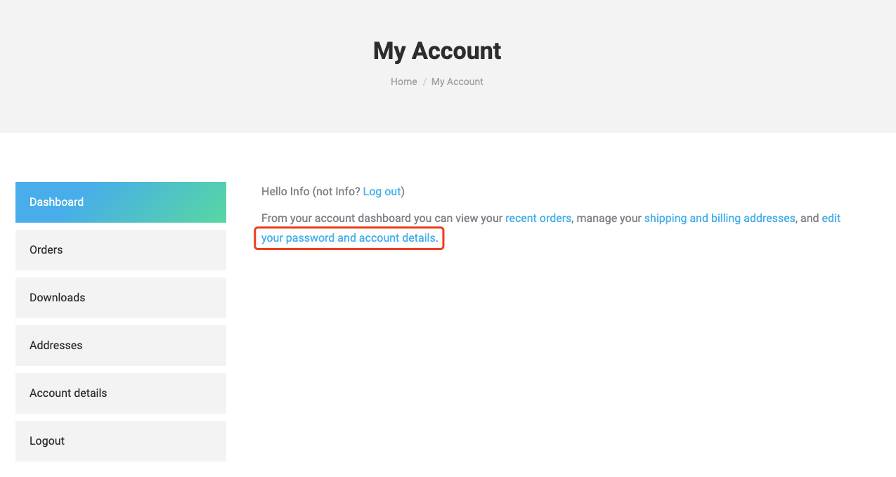
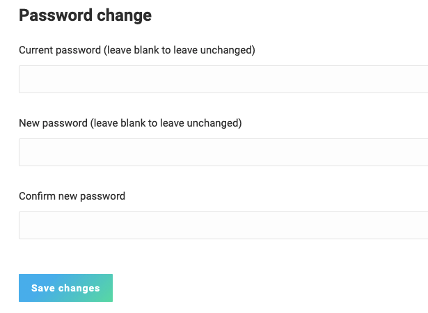

# Heltec LoRaWAN 测试服务器登录问题

[English](https://heltec-automation-docs.readthedocs.io/en/latest/general/tts_v3_login_issue.html)

2021 年 6 月，我们将 Heltec Cloud Server 替换为更科学的 TTS V3，这是一个永久免费的服务器。 可以用于一些简单应用的通信测试和生产环境。在原有TTS V3的基础上，我们增加了用户同步功能。 这样做的目的是为了让Heltec官网账号可以同时登录Heltec论坛和Heltec的LoRaWAN测试服务器。

但是，用户同步功能在 TTS V3 上似乎有一些问题（并非总是发生）。 我们正在积极纠正这个错误。 在修复这个bug之前，可以通过以下方式解决问题：

1. 在[此页面](https://heltec.org/my-account/)中登录您的 Heltec官网帐户；

2. 在`My account`页面中，点击“edit your password and account details”；

   

3. 在“Password change”区域更改您的密码：

   

4. 再次登录[Heltec LoRaWAN 测试服务器](https://lora.heltec.org/)。
