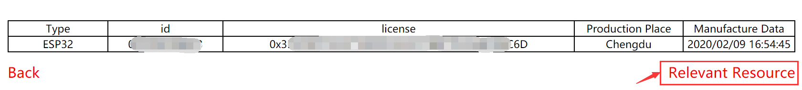
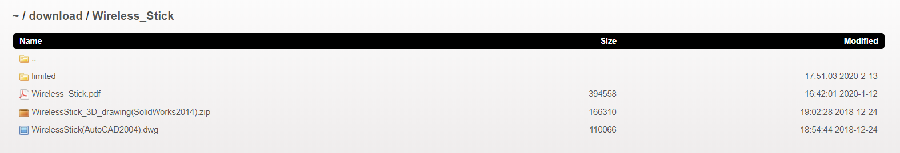
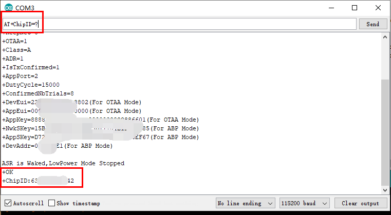

# 获取受限的技术资源
[English](https://heltec-automation-docs.readthedocs.io/en/latest/general/view_limited_technical_data.html)

我们在[GitHub](https://GitHub.com/HelTecAutomation)或[Resource Page](http://Resource.heltec.cn/)中发布了所有相关资源。

有些技术资料是Heltec生产的产品专用的，没有公开，这些相关的资源可以在查询网页通过输入芯片ID下载，同时芯片ID也可以用来识别真伪。

## 通过芯片ID获取受限的技术资源

受限的资源将在输入产品的芯片ID后可下载，这是一个唯一的ID。
在[http://resource.heltec.cn/search](http://resource.heltec.cn/search)网页输入芯片ID，然后单击“Confirm”。


在这里将会显示一些关于这个开发板的基本信息，点击“Relevant Resource”。

``` Tip:: 此页面中的license也有用，例如ESP32+LoRa系列，ESP32_LoRaWAN库需要此license才能激活。

```



现在，将进入到产品的下载页面。受限文件夹中的文件将可下载。



**大约在2018年冬季以前，我们开始没有完全管理芯片ID。以前的一些产品芯片ID还没有同步到这个数据库。用户可以发送邮件到[support@heltec.cn](mailto:support@heltec.cn)，我们将为您重新生成一个**

&nbsp;

## 怎样获得芯片ID

产品的芯片ID是相对于板载MCU的，每个MCU都有一个唯一的ID。

- [ESP32 Core](#esp32)
- [STM32 Core](#stm32)
  - LoRa Node 030
  - [LoRa Node 151](#lora-node-151)
  - [Turtle Board](#turtle-board)
- [CubeCell Series (ASR650x Core)](#cubecell)

### ESP32系列

确保你已经正确安装[Heltec ESP32开发环境框架](https://heltec-automation.readthedocs.io/zh_CN/latest/esp32/quick_start.html).

使用这个示例代码: [Get Chip ID example](https://github.com/Heltec-Aaron-Lee/WiFi_Kit_series/blob/master/esp32/libraries/ESP32/examples/ChipID/GetChipID/GetChipID.ino)。

上传这个示例代码后，芯片ID将在串口打印出来。


### STM32系列

[Heltec STM32+LoRa系列快速入门](https://heltec-automation.readthedocs.io/zh_CN/latest/stm32/quick_start.html)可能对以下操作有帮助。

#### LoRa Node 151

[怎样下载固件到LoRa Node 151](https://heltec-automation.readthedocs.io/zh_CN/latest/stm32/lora_node_151/download_firmware.html)

[LoRa Node 151](https://heltec.org/project/lora-node-151/)使用STM32L151CCU6芯片,下载下面的固件到LoRa Node 151:

[http://resource.heltec.cn/download/LoRa_Node_151/L151_Read_ID.zip](http://resource.heltec.cn/download/LoRa_Node_151/L151_Read_ID.zip)

然后芯片ID会通过虚拟串口(USB-CDC)打印出来。


&nbsp;

#### Turtle Board

[怎样下载固件到Turtle Board](https://heltec-automation.readthedocs.io/zh_CN/latest/stm32/turtle_board/download_firmware.html)

[Turtle Board](https://heltec.org/project/turtle-board/)使用STM32L432KC芯片,下载下面的固件到Turtle Board:

然后芯片ID会通过虚拟串口(USB-CDC)打印出来。

&nbsp;

### CubeCell系列

CubeCell几乎所有的资源都是开源的。用户可以通过AT命令查询芯片ID：

```shell
AT+ChipID=?
```



或者通过[Get ChipID](https://github.com/HelTecAutomation/ASR650x-Arduino/blob/master/libraries/Basics/examples/ChipID/ChipID.ino)示例代码:

