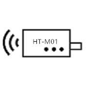
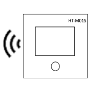

Heltec Automation文档页
=======================
`English <https://heltec-automation-docs.readthedocs.io/en/latest/index.html>`_

这些是 `Heltec Automation <https://heltec.org>`_ 产品的文档。

节点
----
 
==================  ==================  ==================
|CubeCell|_         |ESP32+LoRa|_       |STM32+LoRa|_
------------------  ------------------  ------------------
`CubeCell`_         `ESP32+LoRa`_       `STM32+LoRa`_
------------------  ------------------  ------------------ 
|ESP32+Arduino|_    |ESP8266+Arduino|_    
------------------  ------------------  ------------------ 
`ESP32+Arduino`_    `ESP8266+Arduino`_  
==================  ==================  ==================

.. _CubeCell: cubecell/index.html

.. |ESP32+LoRa| image:: img/02.png
.. _ESP32+LoRa: esp32/index.html

.. _STM32+LoRa: stm32/index.html

.. |ESP32+Arduino| image:: img/04.png
.. _ESP32+Arduino: esp32+arduino/index.html

.. |ESP8266+Arduino| image:: img/05.png
.. _ESP8266+Arduino: esp8266+arduino/index.html

网关
----

==================  ==================  ==================
|HT-M00|_           |HT-M01|_           |HT-M01S|_
------------------  ------------------  ------------------
`HT-M00`_           `HT-M01`_           `HT-M01S`_    
------------------  ------------------  ------------------ 
|HT-M02_4G/LTE|_    |HT-M02_POE|_
------------------  ------------------  ------------------ 
`HT-M02_4G/LTE`_    `HT-M02_POE`_
==================  ==================  ==================

.. _HT-M00: gateway/ht-m00/index.html

.. _HT-M01: gateway/ht-m01/index.html

.. _HT-M01S: gateway/ht-m01s/index.html

.. _HT-M02_4G/LTE: gateway/ht-m02_4g/index.html

.. _HT-M02_POE: gateway/ht-m02_poe/index.html

通用文档
--------

==================  ==================  ==================
|General Docs|_
------------------  ------------------  ------------------
`General Docs`_
==================  ==================  ==================

.. |General Docs| image:: img/06.png
.. _General Docs: general/index.html

.. toctree::
   :hidden:
   :caption: 语言
   
   English <https://heltec-automation-docs.readthedocs.io/en/latest/index.html>

.. toctree::
   :hidden:
   :caption: LORA GATEWAY
   
   gateway/index
   gateway/sx1301module/index
   gateway/ht-m00l/index
   gateway/ht-m00/index
   gateway/ht-m01/index
   gateway/ht-m01s/index
   gateway/ht-m02_4g/index
   gateway/ht-m02_poe/index
   常见问题 <gateway/frequently_asked_questions>
   
.. toctree::
   :hidden:
   :caption: CubeCell

   cubecell/index
   快速入门 <cubecell/quick_start>
   cubecell/lorawan/index
   AT命令列表 <https://resource.heltec.cn/download/CubeCell/AT_Command_list_zh-CN/CubeCell_Series_AT_Command_User_Manual_zh_CN_V0.6.pdf>
   cubecell/dev-board/index
   cubecell/capsule-sensor/index
   cubecell/module/index
   常见问题 <cubecell/frequently_asked_questions>

.. toctree::
   :hidden:
   :caption: ESP32 + LoRa

   esp32/index
   快速入门 <esp32/quick_start>
   esp32/lorawan/index
   最大距离测试 <esp32/distance_test>
   esp32/wifi_lora_32/index
   esp32/wireless_stick/index
   esp32/wireless_stick_lite/index
   esp32/wireless_shell/index
   esp32/wireless_bridge/index
   常见问题 <esp32/frequently_asked_questions>

.. toctree::
   :hidden:
   :caption: STM32 + LoRa

   stm32/index
   快速入门 <stm32/quick_start>
   stm32/lorawan/index
   stm32/lora_node_151/index
   stm32/turtle_board/index
   常见问题 <stm32/frequently_asked_questions>

.. toctree::
   :hidden:
   :caption: ESP32 + Arduino
   
   esp32+arduino/index
   快速入门 <esp32+arduino/quick_start>
   esp32+arduino/wifi_kit_32/index
   常见问题 <esp32+arduino/frequently_asked_questions>
   
.. toctree::
   :hidden:
   :caption: ESP8266 + Arduino

   esp8266+arduino/index
   快速入门 <esp8266+arduino/quick_start>
   esp8266+arduino/wifi_kit_8/index
   常见问题 <esp8266+arduino/frequently_asked_questions>

.. toctree::
   :hidden:
   :caption: General Docs

   general/index
   怎样安装Git和Arduino <general/how_to_install_git_and_arduino>
   建立串行连接 <general/establish_serial_connection>
   LoRaWAN子频带使用示例 <general/sub_band_usage>
   LORaWAN频率计划 <general/lorawan_frequency_plans>
   各国的LoRaWAN频率计划和法规 <general/lorawan_frequency_plans_by_country>
   订阅MQTT消息 <general/subscribe_mqtt_messages>
   发布MQTT消息 <general/publish_mqtt_message>
   解码LoRaWAN有效载荷 <general/decode_payload>
   怎样配置树莓派 <general/how_to_config_raspberry_pi>
   获取受限的技术资源 <general/view_limited_technical_data>
   连接到单通道网关 <general/connect_to_single_channel_gateway>
   Heltec LoRaWAN 测试服务器登录问题 <general/tts_v3_login_issue>