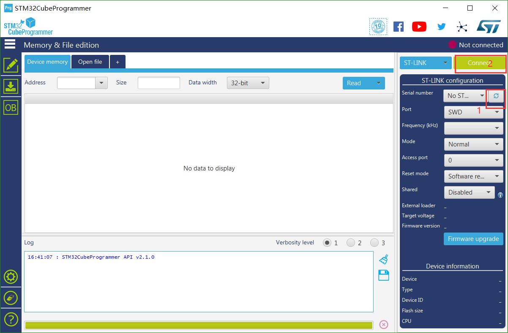

# HeltecTM STM32+LoRa系列常见问题
[English](https://heltec-automation-docs.readthedocs.io/en/latest/stm32/frequently_asked_questions.html)

此页面包含用户最常提出的问题。如果此页面的详细信息无法解决您的问题，您也可以在我们的论坛中留言： [community.heltec.cn](http://community.heltec.cn/)

&nbsp;

## 无法下载固件

- 使用Micro-USB数据线。
  - 使用质量更好的Micro-USB数据线或者更换Micro-USB底座；
  - 正确进入DFU模式。
  
- 使用ST-LINK。
  
  - 确保开发板正确连接到ST-LINK。
  - 关于使用ST-LINK无法下载固件的解决方案(这个方法主要针对Node151):
  
  如图所示: 正常进行1的步骤 -> 在继续执行第二步之前，先按住RST键不要松开-> 进行第二步, 释放RST键.
  
  
  
  造成这种情况的原因是：为了实现**极致低功耗**，我们禁用了大多数通常不使用的引脚。

* 固件的下载方法:
  * [LoRa Node 151下载固件](https://heltec-automation.readthedocs.io/zh_CN/latest/stm32/lora_node_151/download_firmware.html)；
  * [Turtle Board下载固件](https://heltec-automation.readthedocs.io/zh_CN/latest/stm32/turtle_board/download_firmware.html)。

## 串口无输出

- 使用USB-CDC(USB-虚拟串口)
  - USB-CDC没有配置正确(你可以参考我们的例程)。
- 使用USB-UART
  - 确保开发板正确连接到USB-UART模块。

请参考下列文档:

- [LoRa Node 151建立串行连接](https://heltec-automation.readthedocs.io/zh_CN/latest/stm32/lora_node_151/establish_serial_connection.html)；
- [Turtle Board建立串行连接](https://heltec-automation.readthedocs.io/zh_CN/latest/stm32/turtle_board/establish_serial_connection.html).