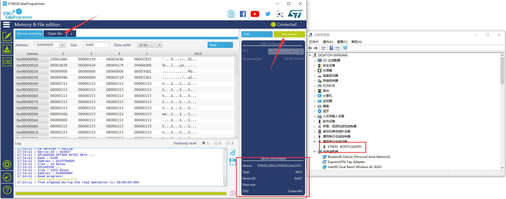
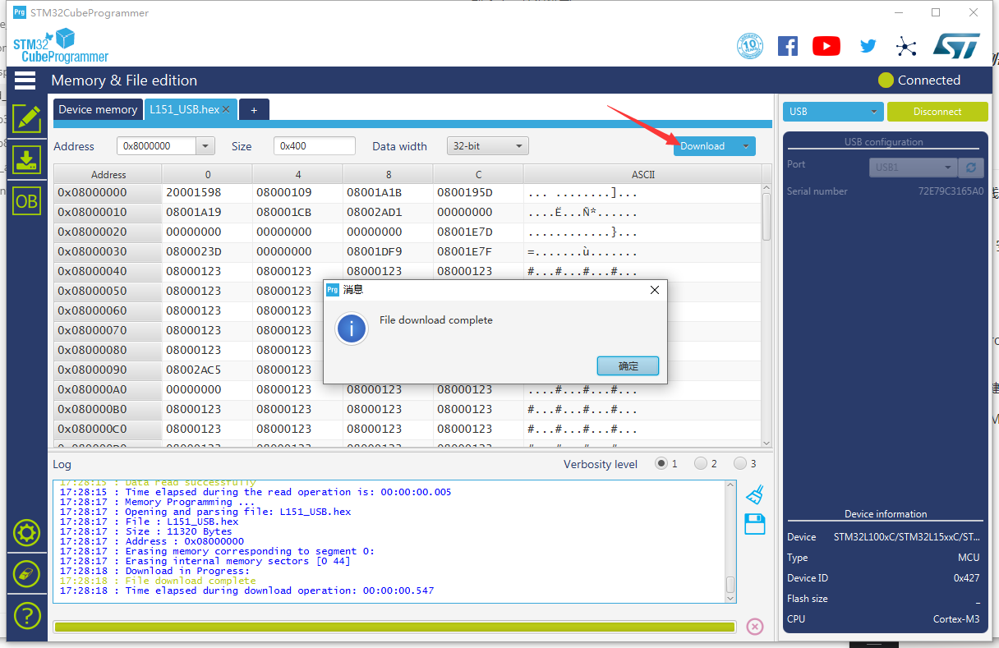
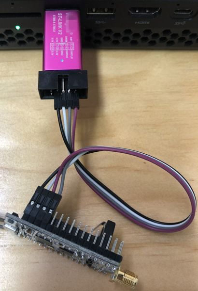
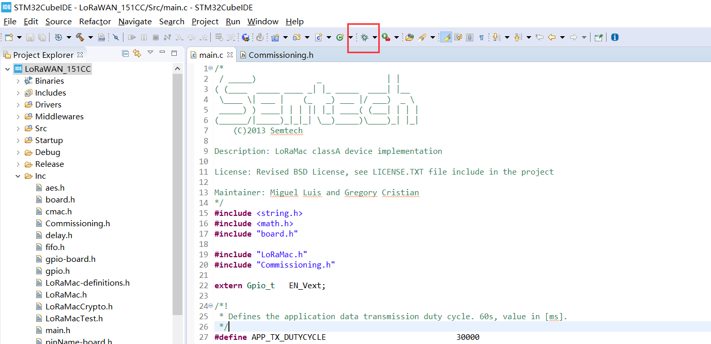

# 下载固件
[English](https://heltec-automation-docs.readthedocs.io/en/latest/stm32/lora_node_151/download_firmware.html)
## 通过DFU模式

STM32L151CCU6芯片已经包含了DFU Bootloader，这意味着只需要一根Micro-USB数据线，用户就可以将.elf/.bin文件下载到主板中。

- 怎样进入DFU模式

  - 如果开发板未连接到计算机，则在将其插入计算机的任何USB端口之前，请按住Lora节点的“USER”按钮（在插入之前，请一直按住“USER”键，然后在连接到USB端口后将其释放）
  - 如果电路板已连接到计算机--保持按下“USER”按钮→按下“RST”按钮→松开“RST”按钮→松开“USER”按钮。
  
- 下载固件

  如果成功进入DFU模式（驱动程序安装正确），则可以在设备管理器中看到名为“STM32 BOOTLOADER”的设备。在STM32CubeProg软件中，选择USB并单击“Connect”读取芯片信息。

  

  打开一个.elf/.bin文件并单击“Download”图标。

  


**使用DFU模式的优点是您可以轻松找到微型Micro-USB数据线，但缺点是无法在线模拟。**


## 通过ST-LINK

- 怎样连接到ST-LINK。

  将ST-LINK正确连接到LoRa节点，请参考此图。

  

  ```Tip:: ST-LINK可以为目标设备提供电源！如果LoRa节点通过Micro-USB数据线连接到计算机，则ST-LINK 3.3V不能连接到VDD！这样做可能会损坏开发板！

  ```
  
- 下载固件

  正确连接ST-LINK后，单击此图标。



**使用ST-LINK方法的优点是可以使用STM32CubeIDE进行单步调试，但缺点是需要ST-LINK调试器工具。**