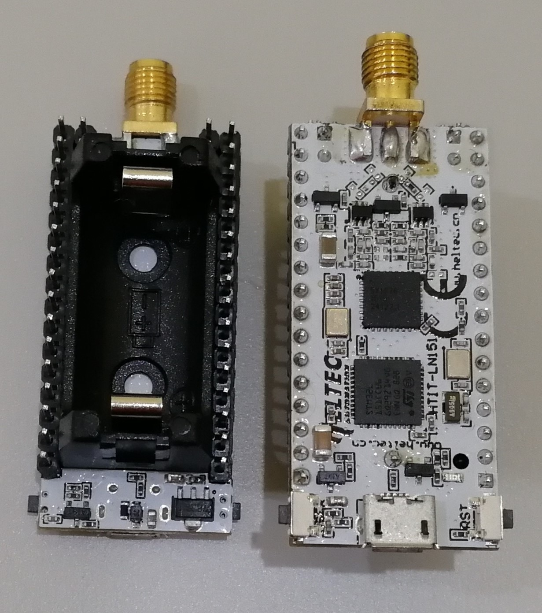

# LoRa Node 151硬件更新日志
[English](https://heltec-automation-docs.readthedocs.io/en/latest/stm32/lora_node_151/hardware_update_log.html)
## V1

- 首次发布
- 2017-6-1 公开销售
- [V1引脚图](http://resource.heltec.cn/download/LoRa_Node_151/LoRa_Node_151_Pinout_Diagram.pdf)
- [V1原理图](http://resource.heltec.cn/download/LoRa_Node_151/LoRa_Node_151_Block_Diagram_V1.pdf)

## V2.0

- 2019-10-20 公开销售
- 将射频开关从PE4259更换为UPG2179

- [V2.0引脚图](http://resource.heltec.cn/download/LoRa_Node_151/LoRa_Node_151_Pinout_Diagram.pdf)
- [V2.0原理图](https://resource.heltec.cn/download/LoRa_Node_151/LoRa_Node_151_Block_Diagram_V2.2.pdf)

## v2.2

- 2020-04-01 公开销售
- 增加版本号

- [V2.2引脚图](http://resource.heltec.cn/download/LoRa_Node_151/LoRa_Node_151_Pinout_Diagram.pdf)
- [V2.2原理图](https://resource.heltec.cn/download/LoRa_Node_151/LoRa_Node_151_Block_Diagram_V2.2.pdf)