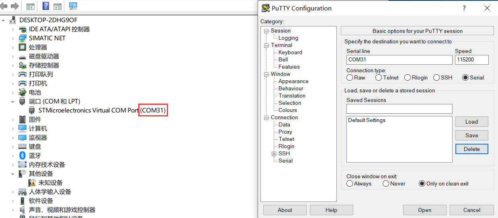
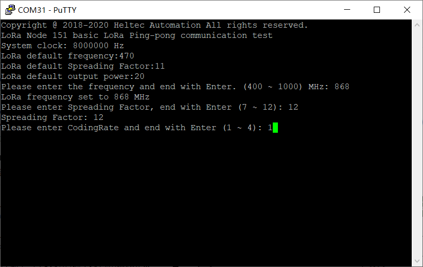
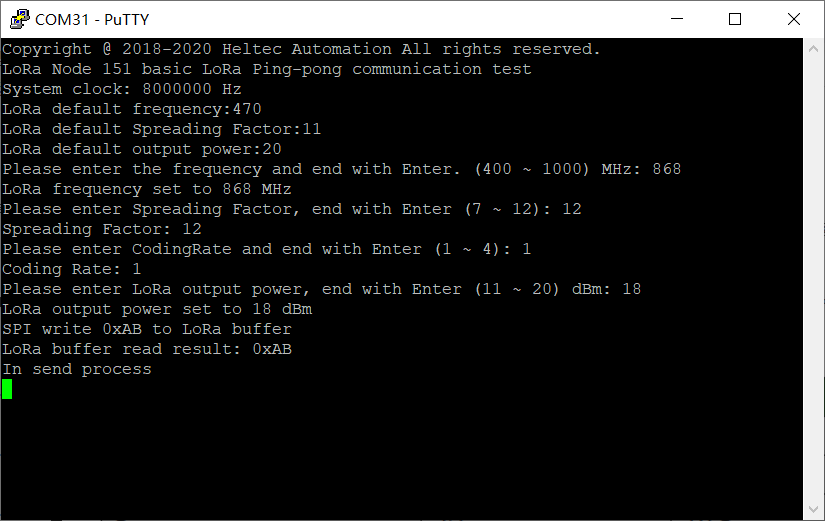
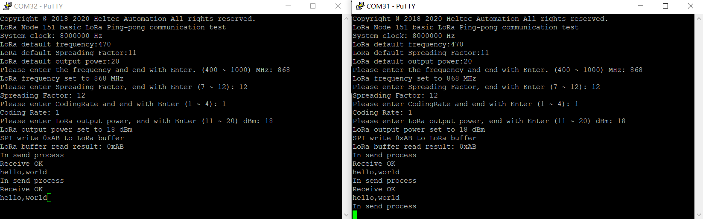

# LoRa Node 151 Pingpong测试
[English](https://heltec-automation-docs.readthedocs.io/en/latest/stm32/lora_node_151/pingpong_test.html)

## 准备

- 下载LoRa Node 151 pingpong示例: [pingpong_CDC](http://resource.heltec.cn/download/LoRa_Node_151/Pingpong_CDC.zip)

- 下载固件到LoRa Node 151，请参考[下载固件](https://heltec-automation.readthedocs.io/zh_CN/latest/stm32/lora_node_151/download_firmware.html)

## 开始测试

正确下载固件后将开发板连接到电脑，并打开串口。



打开串口后会配置一些参数，如果您没有进行配置，那么会选用默认参数。

- 配置频段

  

- 配置扩频因子

  

- 配置编码率

  

- 配置输出功率

  

配置完成后，节点将进入等待状态。



再按相同方法配置另一个LoRa Node 151节点，配置完成后两个节点将进入pingpong测试。



```Tip:: 频段和扩频因子需配置为相同参数，否则会无法通信。

```