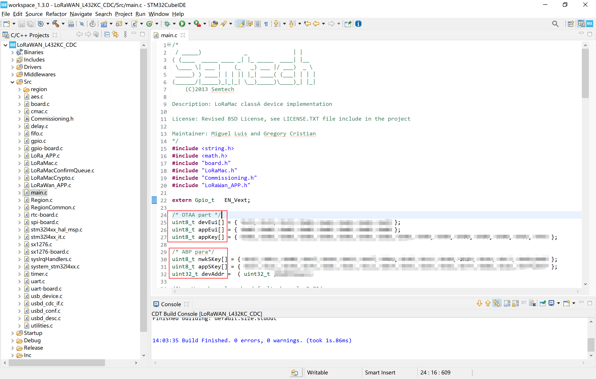
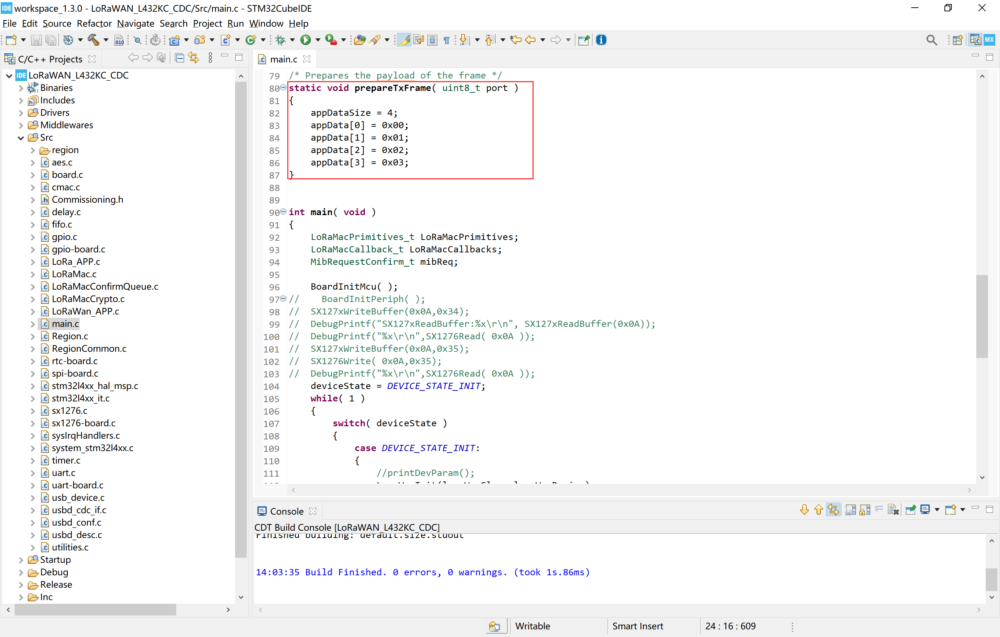

# "STM32 + LoRa"准备和配置参数
[English](https://heltec-automation-docs.readthedocs.io/en/latest/stm32/lorawan/config_parameter.html)

[LoRa Node 151](https://heltec.org/project/lora-node-151/)基于[STM32L151CCU6](https://www.st.com/resource/en/datasheet/stm32l151cc.pdf)芯片, [Turtle Board](https://heltec.org/project/turtle-board/)基于[STM32L432KC](https://www.st.com/resource/en/datasheet/stm32l432KC.pdf)芯片, 我们公司正在逐步将IDE替换为[STM32CubeIDE](https://www.st.com/en/development-tools/stm32cubeide.html)，这是STMicroelectronics官方刚刚为自己的MCU推出的开发工具。基于Eclipse，包括代码跟踪、代码编写、编译、下载、单步调试，并与CubdeMX集成。

## 摘要

无论使用何种LoRa管理平台，都需要DevEui、AppKey等参数。并确保它与服务器上的相关设置一致。

- **以下参数对于OTAA模式至关重要：**
  - DevEui -- Mote device IEEE EUI (big endian), 8 bytes;
  - AppEui -- Application IEEE EUI (big endian), 8 bytes;
  - AppKey -- AES encryption/decryption cipher application key, 16 bytes;
- **以下参数对于ABP模式至关重要：**
  - NwkSKey -- AES encryption/decryption cipher network session key, 16 bytes;
  - AppSKey -- AES encryption/decryption cipher application session key, 16 bytes;
  - DevAddr -- Device address on the network (big endian), uint32_t;

&nbsp;

## 准备

- 正确安装[STM32CubeIDE](https://www.st.com/zh/development-tools/stm32cubeide.html#get-software) and [STM32CubeProgrammer](https://www.st.com/zh/development-tools/stm32cubeprog.html)
- 至少有8个通道的标准LoRaWAN网关（基于SX1301/8基带芯片即可），并确保您的网关已连接到LoRa服务器。
  - [怎样连接HT-M01到LoRa服务器](https://heltec-automation.readthedocs.io/zh_CN/latest/gateway/ht-m01/connect_to_server.html).
  - [怎样连接HT-M02到LoRa服务器](https://heltec-automation.readthedocs.io/zh_CN/latest/gateway/ht-m02_4g/quick_start_4g.html#lora).
- 一个STM32 LoRa节点( [LoRa Node 151](https://heltec.org/project/lora-node-151/) , [Turtle Board](https://heltec.org/project/turtle-board/)), 一根高质量的Micro-USB数据线和一个ST-LINK。

&nbsp;

## 配置步骤

LoRa节点的LoRaWAN例程代码是一个STM32CubeIDE项目，下面是基本的配置步骤。

正确下载并安装 `STM32CubeIDE` and `STM32CubeProgramme`；

双击`.project` 文件，打开这个工程；

第一次运行时，可能会出现以下对话框，单击“是”，然后单击“确定”。

&nbsp;

- 修改宏定义：设置工作频段，工作模式，调试打印。

  - `ACTIVE_CLASS`

    `CLASS_A`

    `CLASS_B`--目前不支持

    `CLASS_C`

   - `ACTIVE_REGION`

     `LORAMAC_REGION_AS923`

     `LORAMAC_REGION_AU915`

     `LORAMAC_REGION_CN470`

     `LORAMAC_REGION_CN779`

     `LORAMAC_REGION_EU433`

     `LORAMAC_REGION_EU868`

     `LORAMAC_REGION_KR920`

     `LORAMAC_REGION_IN865`

     `LORAMAC_REGION_US915`

     `LORAMAC_REGION_US915_HYBRID`

     `LORAMAC_REGION_AU915_SB2`

     `LORAMAC_REGION_AS923_AS1`

     `LORAMAC_REGION_AS923_AS2`

   - `REGION_EU868`
     设置为与`ACTIVE_REGION`对应的频段
   - `USE_DEBUGGER` 

     如果定义 `USE_DEBUGGER` , 默认串口(PA9-TX, PA10-RX)将打印调试信息。

     如果删除 `USE_DEBUGGER` , 则不会打印调试信息。

- 在`main.c`文件中将`DEVICE_EUI`, `APPLICATION_KEY`, `APPLICATION_EUI` 修改为你需要的值。

- 在`main.c`文件中将`userChannelMask`、`overTheAirActivation`和其他参数设置为你需要的值。

  

  - `overTheAirActivation`

`true`--OTAA

`false`--ABP

- 在`prepareTxFrame`中填入你要发送的数据.

现在，把程序下载到你的开发板上，如果一切正常，它应该可以正常运行。

- 你或许需要: 如何将固件下载到STM32 LoRa节点([LoRa Node 151](https://heltec-automation-docs.readthedocs.io/en/latest/stm32/lora_node_151/download_firmware.html), [Turtle Board](https://heltec-automation-docs.readthedocs.io/en/latest/stm32/turtle_board/download_firmware.html)).
