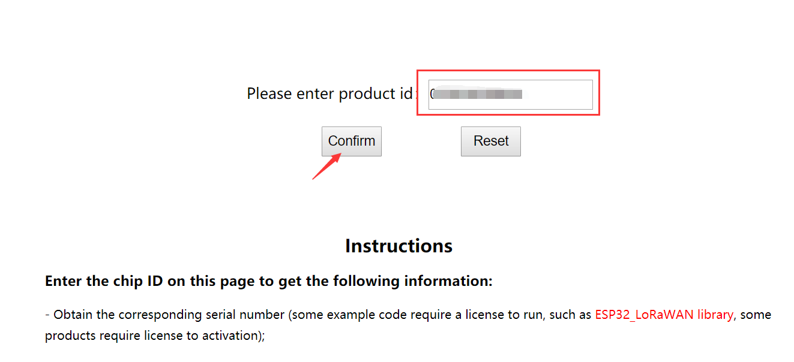

# 获取LoRaWAN例程代码
[English](https://heltec-automation-docs.readthedocs.io/en/latest/stm32/lorawan/get_lorawan_example_code.html)
## 获取芯片ID

请参考这篇文档:[获取芯片ID](https://heltec-automation.readthedocs.io/zh_CN/latest/general/view_limited_technical_data.html#id1)

## 获取LoRaWAN例程代码

一些示例代码是受限的技术数据，购买产品后将可下载。请参阅以下步骤。

- 复制芯片ID，然后打开这个链接：[http://www.heltec.cn/search/](http://www.heltec.cn/search/).

- 输入芯片ID，点击 `Confirm` .

  

- 您可以看到一些关于这个开发板的信息，点击“Relevant Resource”，您可以看到例程代码。

  

  &nbsp;

**Tip: 由于2018年冬季以前的一些产品数据尚未同步到服务器，如果您无法通过此方法获得例程代码，可以发送邮件到[support@heltec.cn](mailto:support@heltec.cn)。**