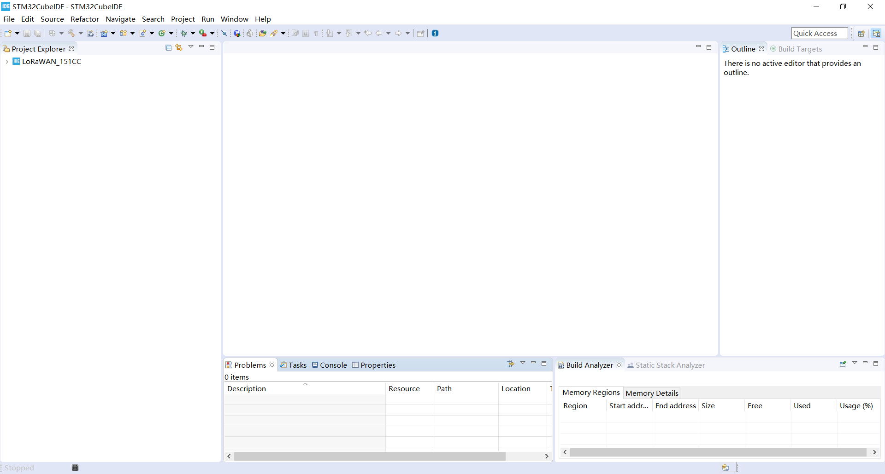
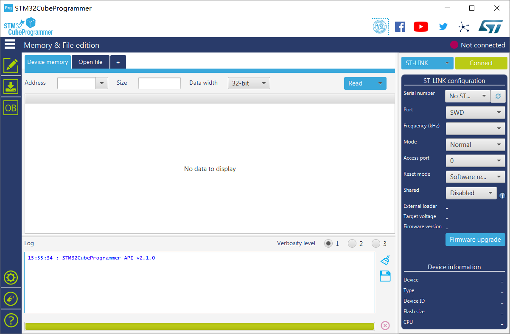

# Heltec STM32+LoRa系列快速入门
[English](https://heltec-automation-docs.readthedocs.io/en/latest/stm32/quick_start.html)

我们建议您先确认是否已安装“STM32CubeIDE”和“STM32CubeProgrammer”。如果没有安装，请安装 [STM32CubeIDE](https://www.st.com/zh/development-tools/stm32cubeide.html#get-software)和[STM32CubeProgrammer](https://www.st.com/zh/development-tools/stm32cubeprog.html) .

## 安装STM32CubeIDE

请点击这个链接下载“STM32CubeIDE”。

[https://www.st.com/zh/development-tools/stm32cubeide.html](https://www.st.com/zh/development-tools/stm32cubeide.html)

正确安装”STM32CubeIDE “。

&nbsp;

## 安装STM32CubeProgrammer

请点击这个链接下载“STM32CubeProgrammer“。

[https://www.st.com/zh/development-tools/stm32cubeprog.html](https://www.st.com/zh/development-tools/stm32cubeprog.html)

正确安装”STM32CubeProgrammer“。

