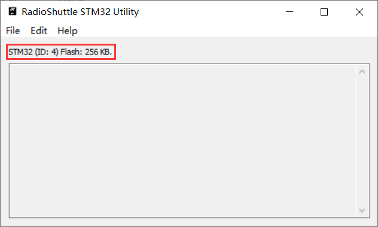
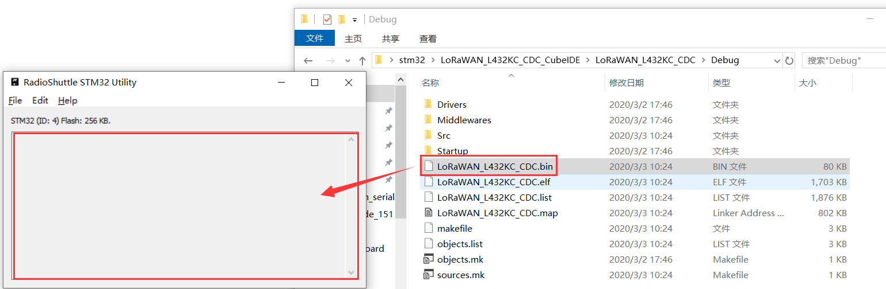
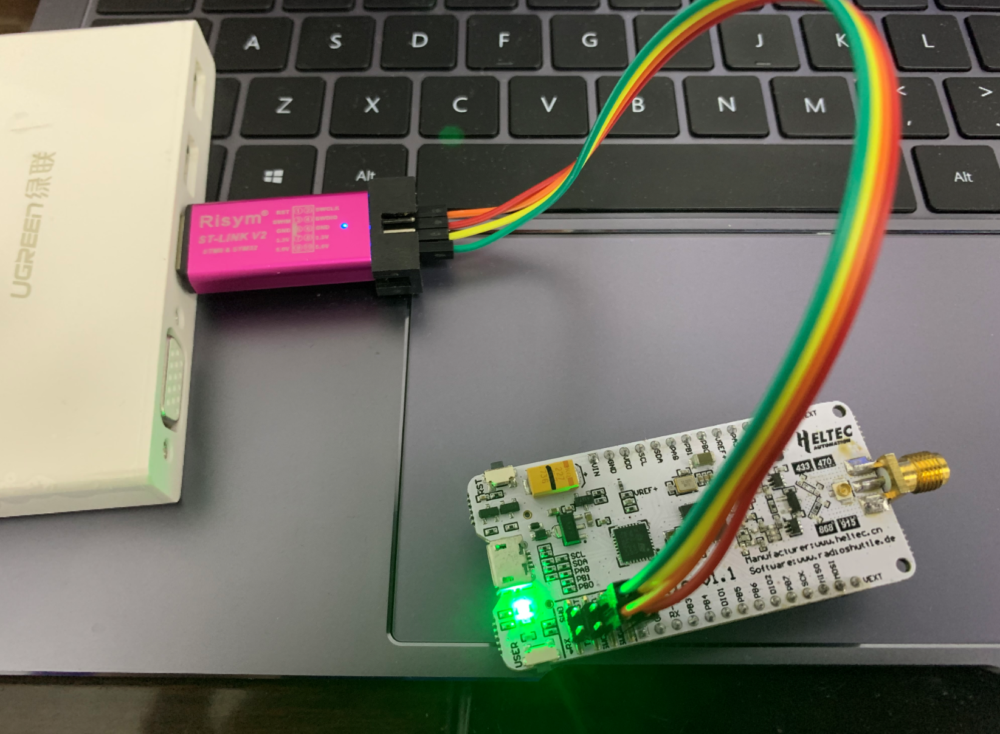
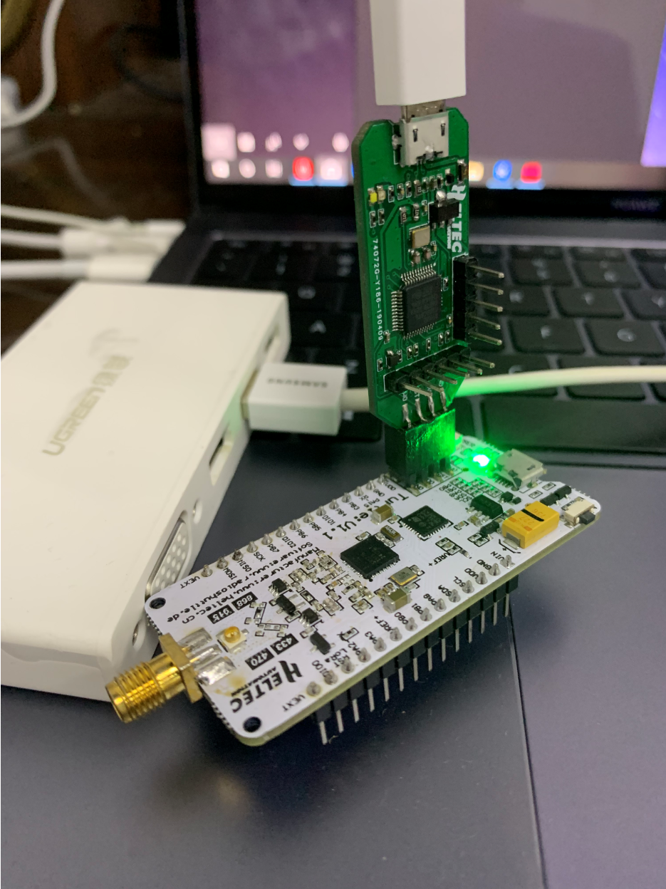
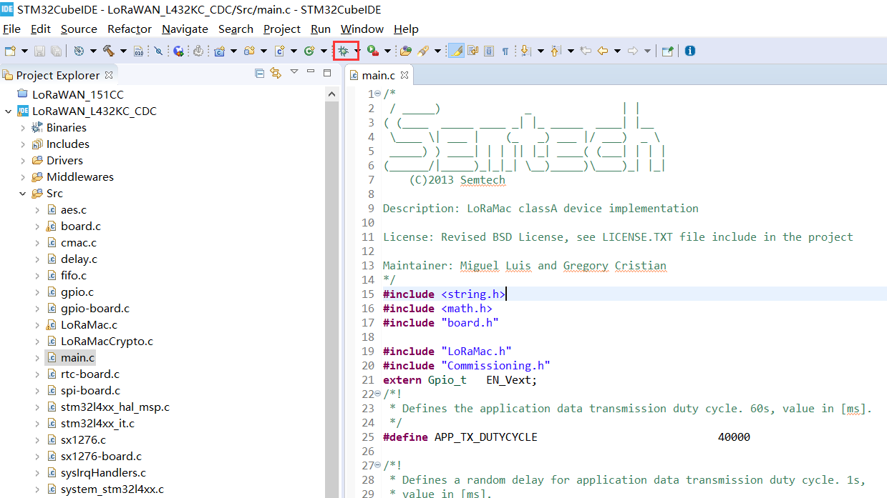

# 下载固件
[English](https://heltec-automation-docs.readthedocs.io/en/latest/stm32/turtle_board/download_firmware.html)
## 通过DFU模式

STM32L432KC芯片已经包含了DFU Bootloader，这意味着只需要一根Micro-USB数据线，用户就可以将.elf/.bin文件下载到开发板中。

- 怎样进入DFU模式

  - 如果开发板未连接到计算机，则在将其插入计算机的任何USB端口之前，请按住Lora节点的“USER”按钮（在插入之前，请一直按住“USER”键，然后在连接到USB端口后将其释放）；
  - 如果电路板已连接到计算机--保持按下“USER”按钮→按下“RST”按钮→松开“RST”按钮→松开“USER”按钮。

- 下载固件 

  - 如果成功进入DFU模式（驱动程序安装正确），则可以在“RadioShuttle STM32 Utility”中看到STM32Flash 。

    

  - 将“.bin”文件拖到窗口中。

  

  ```Warning:: 对于Turtle Board，如果使用“STM32CubeProgrammer”下载固件，可能会损坏Turtle Board的bootloader，因此建议使用“RadioShuttle STM32 Utility”。

  ```

  **使用DFU模式的优点是您可以轻松找到Micro-USB 数据线。但缺点是无法在线模拟**
  
  了解更多关于`RadioShuttle STM32 Utility` 请点击：

  [https://www.radioshuttle.de/en/turtle-en/radioshuttle-stm32-utility-en/](https://www.radioshuttle.de/en/turtle-en/radioshuttle-stm32-utility-en/) .

  下载`RadioShuttle STM32 Utility` 请点击：
  
   [https://www.radioshuttle.de/wp-content/uploads/2019/04/RadioShuttle-STM32-Tools-1.1.1.zip](https://www.radioshuttle.de/wp-content/uploads/2019/04/RadioShuttle-STM32-Tools-1.1.1.zip) .
  
  &nbsp;

## 通过ST-LINK

- 怎样连接ST-LINK

  将ST-LINK正确连接到LoRa节点，请参考此图。

  

  ```Tip:: ST-LINK可以为目标设备提供电源！如果LoRa节点通过Micro-USB数据线连接到计算机，则ST-LINK 3.3V不能连接到VDD！这样做可能会损坏开发板！

  ```
  
  使用与 Turtle Board匹配的ST-LINK。

  

- 下载固件

  正确连接ST-LINK后，点击此图标。

  

**使用ST-LINK方法的优点是可以使用STM32CubeIDE进行单步调试，但缺点是需要ST-LINK调试器工具。**