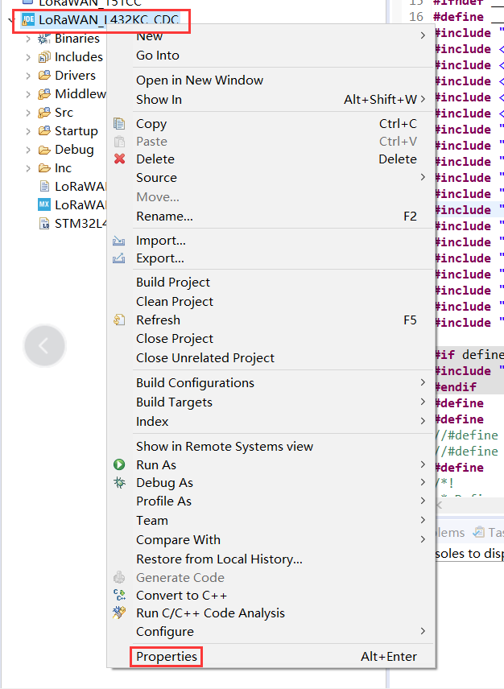
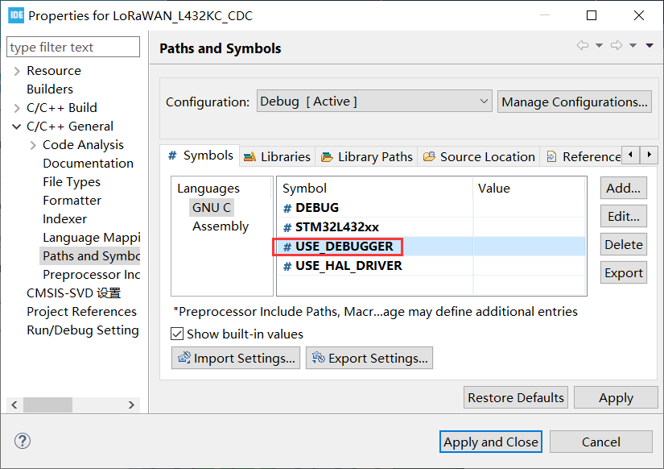
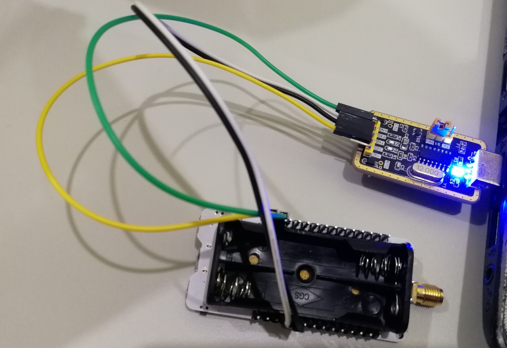
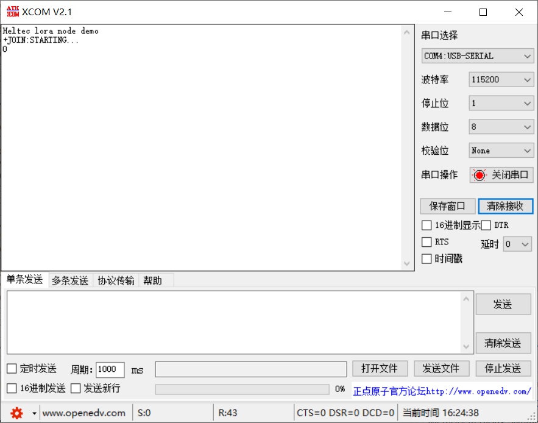
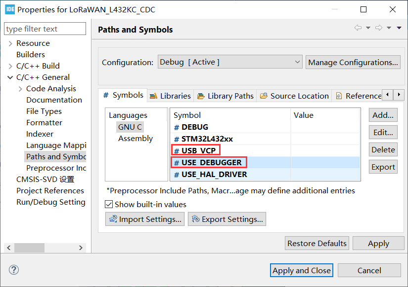
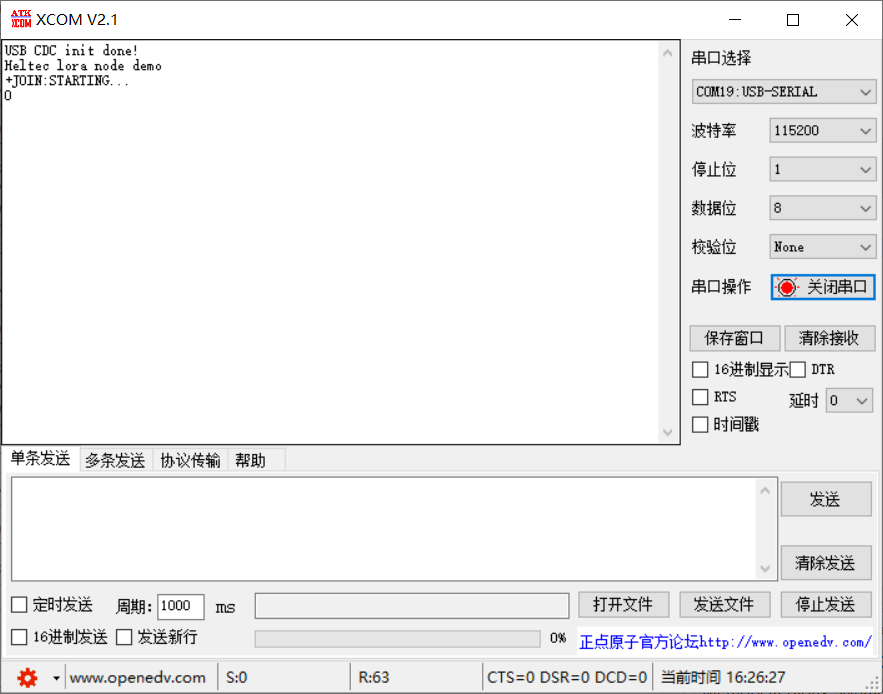

# 建立串行连接
[English](https://heltec-automation-docs.readthedocs.io/en/latest/stm32/turtle_board/establish_serial_connection.html)

Turtle Board可以通过USB-CDC（USB-Virtual Serial Poart）或UART打印调试信息，但USB-UART芯片没有集成在开发板上。如果要通过UART输出调试信息，则需要一个外部USB-UART模块。

## 通过UART

- 打开提供的例程
- 将鼠标悬停在工程上点击右键打开 `Properties`.



- 在宏定义中添加`USE_DEBUGGER`。编译并下载程序。



- 正确连接开发板和USB-UART模块。

```Tip:: LoRa节点和USB-UART模块的连接方式如下（如果LoRa节点通过USB或电池供电，则UART模块的3.3/5V引脚不需要连接，只需要TXD、RXD、GND）。

```



```Tip:: 使用UART时，程序中使用的TX和RX引脚应与板上的TX和RX引脚相对应。在我们提供的例程中，我们使用TX-PA9和RX-PA10。因此，UART模块的TX应连接到开发板的RX（PA10），UART模块的RX应连接到开发板的TX（PA9）。

```

- 打开串行端口

  

&nbsp;

## 通过虚拟串行端口

- 打开提供的例程；
- 将鼠标悬停在工程上点击右键打开 `Properties`；


- 在宏定义中添加`USB_VCP`和`USE_DEBUGGER` ，编译并下载程序。



- 通过Micro-USB数据线将LoRa节点连接到计算机并打开串行端口。

